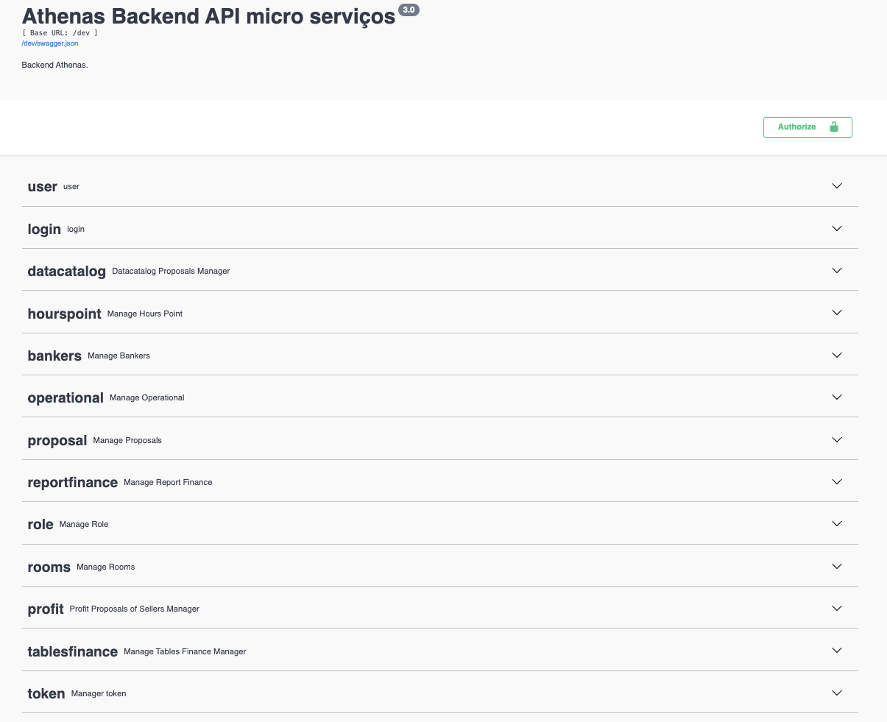
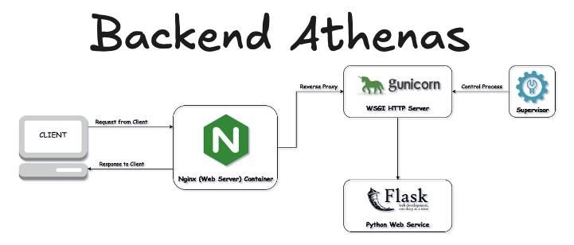
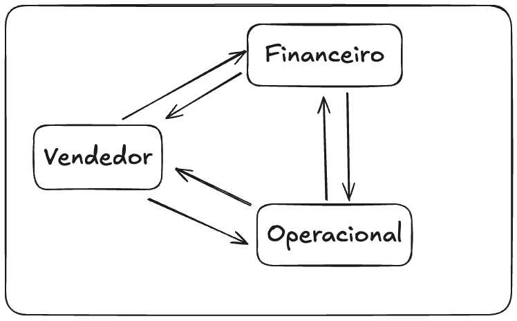

# Backend Athenas ™️ 🚀

Bem-vindo ao **Backend Athenas**, a espinha dorsal da nossa plataforma de CRM! Este projeto foi desenvolvido com foco em eficiência, segurança e escalabilidade, utilizando tecnologias modernas e boas práticas de desenvolvimento.

---

## 📚 Introdução ao Swagger



**Descrição**:  
Desenvolvemos endpoints robustos e seguros, utilizando `Flask-JWT-Extended` para garantir a autenticação e proteção dos dados. A documentação completa da API está disponível via **Swagger**, facilitando a integração e o entendimento dos recursos disponíveis.

---

## 🛠️ Tecnologias Utilizadas

Aqui estão as principais tecnologias que alimentam o **Backend Athenas**:

- **Flask** 🐍: Leve e poderoso, ideal para APIs rápidas e escaláveis.
- **Flask-RESTx** 🔧: Facilita a criação de APIs RESTful com suporte a Swagger.
- **Pandas** 🐼: Para manipulação eficiente de dados.
- **Gunicorn** 🦄: Servidor WSGI para produção.
- **Docker** 🐳: Containerização para fácil deploy e escalabilidade.

**Descrição**:  
Essas ferramentas foram escolhidas a dedo para garantir um desenvolvimento ágil e uma infraestrutura robusta. Ao instalar as dependências, outras bibliotecas podem ser incluídas automaticamente no arquivo `.env`.

---

## 📌 Índice

- [Instalação](#-instalação)
- [Configuração](#-configuração)
- [Uso](#-uso)
- [Tomada de Decisão](#-tomada-de-decisão)
- [Objetivo](#-objetivo)

---

## 🛠️ Instalação

Siga os passos abaixo para configurar o projeto localmente:

1. **Clone o repositório**:
    ```bash
    git clone https://github.com/Hedriss10/Banking-platform-project.git
    ```

2. **Navegue até o diretório do projeto**:
    ```bash
    cd banking-platform-project
    ```

3. **Crie um ambiente virtual**:
    ```bash
    python3 -m venv venv
    ```

4. **Ative o ambiente virtual**:
    - **macOS/Linux**:
        ```bash
        source venv/bin/activate
        ```
    - **Windows**:
        ```bash
        .\venv\Scripts\activate
        ```

5. **Instale as dependências**:
    ```bash
    pip install -r requirements.txt
    ```

---

## 🐳 Docker

### Desenvolvimento

**Gerar a imagem**:
```bash
docker buildx build --platform linux/arm64,linux/amd64 -f Dockerfile -t platform-athenas --load .
```

**Salvar imagem de desenvolvimento**:
```bash
docker save -o platform-athenas-app.tar platform-athenas 
```

**Executar o container**:
```bash
docker run --rm -it -p 5001:5001 platform-athenas
```

### Produção

**Gerar a imagem de produção**:
```bash
docker buildx build --platform linux/amd64 -f Dockerfile.prd -t platform-athenas:prd --load .
```

**Salvar imagem de produção**:
```bash
docker save -o platform-athenas-prd.tar platform-athenas:prd
```

### Comandos Úteis

**Compactar o projeto**:
```bash
tar --exclude=".DS_Store" --exclude="__MACOSX" -czvf platform-athenas.tar src .gitignore Dockerfile.dev docker-compose.yml manage.py
```

**Executar o build com Docker Compose**:
```bash
docker-compose up --build
```

---

## ⚙️ Configuração

1. **Crie um arquivo `.env`** na raiz do projeto e adicione as seguintes variáveis de ambiente:
    ```env
    FLASK_APP=app.py
    FLASK_ENV=development
    JWT_SECRET_KEY=your_secret_key
    ```

---

## 🚀 Uso

**Como rodar o projeto**:

1. **Inicie o servidor Flask**:
    ```bash
    flask run
    ```

2. **Acesse a documentação Swagger**:
    ```
    http://127.0.0.1:5000/docs
    ```

**Executando com Gunicorn**:
```bash
gunicorn -w 4 -b 0.0.0.0:5001 'src.app:create_app()'
```

---

## 🤔 Tomada de Decisão

Após uma análise detalhada das necessidades da empresa, optamos por desenvolver um **CRM básico** totalmente personalizado. Inicialmente, consideramos o uso de `Django`, mas devido à sua natureza "pesada" com muitas libs desnecessárias, escolhemos o **Flask** por sua flexibilidade e leveza.

**Estrutura de Conexão**:



A decisão de utilizar `Flask` permitiu um controle maior sobre o processo e a adoção de boas práticas de servidor, mesmo em um ambiente local.

---

## 🎯 Objetivo



**Descrição**:  
O **Backend Athenas** foi criado para garantir a **persistência de dados** na empresa, conectando setores de forma ágil e sem perda de informações. Nosso objetivo é proporcionar uma comunicação eficiente entre os setores, garantindo que todos os dados estejam sempre disponíveis e seguros.

---

Autor -> Hedris Pereira | **Backend Athenas ™️**  
🚀 **Inovação e Eficiência em cada linha de código.**

---
